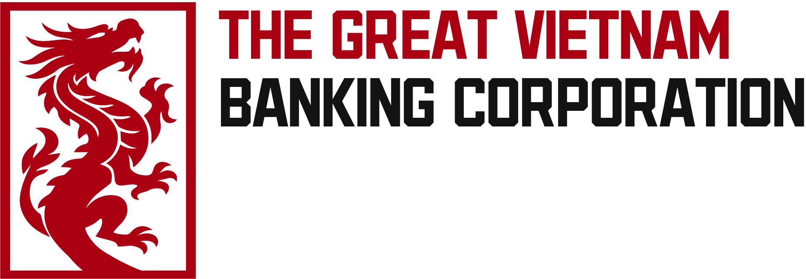

<p align="center">
  
</p>

<h1 align="center">GVBC Reunion</h1>

<p align="center">
  <strong>Live News Feed · Flight Tracking · Ship Tracking</strong><br>
  A real-time intelligence dashboard built with Python, HTML, CSS & JavaScript.
</p>

<p align="center">
  
  
  
  
</p>

---

## ✨ Features

| Feature | Description |
|---------|-------------|
| 📰 **RSS News Feed** | Aggregate articles from any RSS source. Cards with title, summary, date and source badge. |
| ✈️ **Flight Tracking** | Live aircraft positions on a dark Leaflet map via [OpenSky Network](https://opensky-network.org). Auto-refreshes every 15 seconds. |
| 🚢 **Ship Tracking** | Real-time vessel positions via embedded [MarineTraffic](https://www.marinetraffic.com) map. |
| ⚙️ **Settings** | Add, remove, and quick-add popular RSS sources (BBC, Reuters, TechCrunch, Hacker News, NASA, NPR). |

---

## 🏗️ Architecture

```
Browser ─→ Flask (app.py)
              ├─ GET /             → Dashboard (news + maps)
              ├─ GET /settings     → RSS source management
              ├─ GET /api/feed     → feedparser → RSS sources
              ├─ GET /api/flights  → OpenSky Network API (proxy)
              └─ CRUD /api/sources → data/sources.json
```

---

## 🚀 Quick Start

### Prerequisites
- Python 3.10+

### Installation

```bash
# Clone the repository
git clone https://github.com/GoSatoruu/reunion_rss.git
cd reunion_rss

# Install dependencies
pip install -r requirements.txt

# Run the server
python app.py
```

Open **http://localhost:5000** in your browser.

### First Steps
1. Go to **Settings** → Add RSS sources (or use the quick-add chips)
2. Return to **Dashboard** to see your news feed
3. The flight map loads automatically with live data

---

## 📁 Project Structure

```
reunion_rss/
├── app.py                  # Flask backend
├── requirements.txt        # Python dependencies
├── data/
│   └── sources.json        # RSS sources storage (auto-created)
├── branding/               # Brand assets
│   ├── logo.png            # Dragon icon (light bg)
│   ├── logo_dark.png       # Dragon icon (dark bg)
│   ├── full_logo.png       # Full logo with text
│   └── full_logo_dark.png  # Full logo (dark bg)
├── static/
│   ├── css/
│   │   └── style.css       # Dark glassmorphism theme
│   ├── js/
│   │   ├── app.js          # Dashboard logic
│   │   └── settings.js     # Settings CRUD logic
│   └── img/                # Runtime logo copies
├── templates/
│   ├── index.html          # Dashboard page
│   └── settings.html       # Settings page
└── README.md
```

---

## 🔌 API Endpoints

| Method | Endpoint | Description |
|--------|----------|-------------|
| `GET` | `/api/sources` | List all RSS sources |
| `POST` | `/api/sources` | Add a new RSS source (`{"name": "...", "url": "..."}`) |
| `DELETE` | `/api/sources/<id>` | Remove an RSS source |
| `GET` | `/api/feed` | Fetch aggregated articles from all sources |
| `GET` | `/api/flights` | Proxy to OpenSky Network (optional bbox params: `lamin`, `lamax`, `lomin`, `lomax`) |

---

## 🛡️ Data Sources

- **Flight Data**: [OpenSky Network](https://opensky-network.org) — Free, no API key required (anonymous: ~100 req/day)
- **Ship Data**: [MarineTraffic](https://www.marinetraffic.com) — Embedded live map widget
- **RSS Parsing**: [feedparser](https://github.com/kurtmckee/feedparser) — Universal RSS/Atom parser

---

## 📜 License

MIT License — see [LICENSE](LICENSE) for details.

<p align="center">
  
  <br>
  <sub>The Great Vietnam Banking Corporation © 2026</sub>
</p>